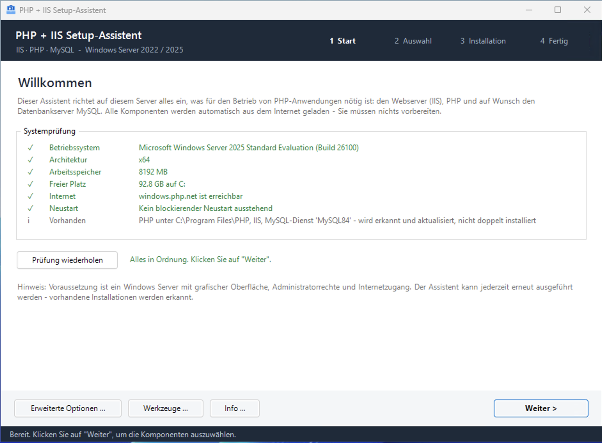

# WIMP

## Windows IIS, MySQL & PHP Installer


Dieses Tool führt einen durch die Installation von IIS, PHP und MySQL Datenbankserver & Workbench.

Ein grafischer Setup-Assistent für Windows Server, der IIS, PHP und – auf Wunsch – MySQL in einem Durchgang einrichtet. Gedacht für Kunden und Kollegen, die keinen Server einrichten möchten, sondern eine lauffähige PHP-Umgebung brauchen: vier Seiten, zwei Auswahlkästchen, ein Klick.

Alles, was normalerweise nach Handbuch, Kommandozeile und einer Stunde Nacharbeit verlangt, passiert im Hintergrund: FastCGI-Handler, Berechtigungen für `IIS_IUSRS` und `IUSR`, OPcache, CA-Bundle für cURL, Timeouts, `maxAllowedContentLength`, MySQL-Dienst mit sicherem root-Passwort.



## Was der Assistent installiert

| Komponente | Details |
|---|---|
| Visual C++ Redistributable 2015–2022 (x64) | wird übersprungen, wenn bereits ≥ 14.30 installiert |
| IIS mit CGI | Installation über DISM, inklusive Verwaltungskonsole und Modul `WebAdministration` |
| IIS URL Rewrite Module 2.1 | wahlweise deutsches oder englisches Paket |
| PHP (NTS, x64) | Version frei wählbar, Liste wird live von windows.php.net geladen |
| MySQL Server 8.4 LTS (Support bis April 2029) | optional, inklusive Dienst, `my.ini`, root-Passwort und Anwendungsdatenbank |
| MySQL Workbench | optional |

PHP landet unter `C:\Program Files\PHP` und wird in den maschinenweiten `PATH` eingetragen. Die `php.ini` entsteht aus `php.ini-production` und wird mit sinnvollen Werten für den IIS-Betrieb versehen.

## Ablauf

Der Assistent führt durch vier Seiten:

1. **Start** – Systemprüfung: Betriebssystem, Architektur, RAM, freier Platz, Internetzugang, ausstehender Neustart, bereits vorhandene Installationen. Bei einem blockierenden Fehler geht es nicht weiter.
2. **Auswahl** – zwei Karten: Webserver + PHP (mit Versionsauswahl und Empfehlung) sowie MySQL (mit Workbench und optionaler Anwendungsdatenbank samt Benutzer und Passwort).
3. **Installation** – Schrittliste mit Fortschritt, Protokoll live daneben. Bei einem Fehler steht die Ursache im Klartext, alle Schritte sind wiederholbar.
4. **Fertig** – Zusammenfassung, root-Passwort zum Kopieren, Testseite öffnen, Protokoll.

Wer mehr will, findet unter **Erweiterte Optionen** die volle Kontrolle: Einzelkomponenten, PHP-Limits und -Pfade, Zeitzone, Extensions-Liste, MySQL-Pfade, Port, InnoDB-Buffer-Pool, Netzwerkfreigabe mit Firewall-Vorschau und eine Tabelle für zusätzliche Datenbankbenutzer. Unter **Werkzeuge** liegen Diagnosefunktionen wie `phpinfo.php` erzeugen, `php.ini` öffnen, IIS neu starten oder `php-cgi.exe` beenden.

## Voraussetzungen

- Windows Server 2022 oder 2025 (x64) mit grafischer Oberfläche
- Administratorrechte – der Assistent fordert sie beim Start selbst an
- Internetzugang, mindestens zu `windows.php.net`, `download.microsoft.com` und `cdn.mysql.com`
- Windows PowerShell 5.1 (bei Windows Server enthalten)

Windows 11 Pro funktioniert ebenfalls und wird nur als Hinweis markiert. Für den produktiven Betrieb ist Client-Windows wegen des lizenzrechtlichen Limits von 10 gleichzeitigen Verbindungen nicht geeignet.

## Verwendung

### Als Skript

```powershell
powershell.exe -NoProfile -ExecutionPolicy Bypass -STA -File .\PHP-IIS-MySQL-Setup.ps1
```

Alternativ Rechtsklick auf die Datei → *Mit PowerShell ausführen*. Fehlen Administratorrechte, startet sich der Assistent automatisch neu und löst die UAC-Abfrage aus.

### Als EXE

Für die Weitergabe an Kunden lässt sich das Skript mit [PS2EXE](https://github.com/MScholtes/PS2EXE) zu einer einzelnen `.exe` kompilieren – Doppelklick, UAC-Abfrage, fertig:

```powershell
powershell.exe -NoProfile -ExecutionPolicy Bypass -File .\Build-Exe.ps1
```

`Build-Exe.ps1` installiert das Modul bei Bedarf, bindet `setup.ico` ein, setzt die Dateieigenschaften und prüft anschließend, ob wirklich eine neue EXE entstanden ist. Ein eigenes Symbol erzeugt `New-Icon.ps1` aus einem PNG:

```powershell
powershell.exe -NoProfile -ExecutionPolicy Bypass -File .\New-Icon.ps1 -Source .\logo.png
```

Die Datei wird als `logo.ico` abgelegt und enthält alle üblichen Auflösungen von 16 bis 256 Pixeln.

> **Hinweis:** Manche Virenscanner schlagen bei PS2EXE-Dateien Alarm, weil der Packer bekannt ist. Das ist ein Fehlalarm – für die Weitergabe empfiehlt sich eine Signatur mit einem Codesigning-Zertifikat.

## Dateien

| Datei | Zweck |
|---|---|
| `PHP-IIS-MySQL-Setup.ps1` | der Assistent selbst |
| `Build-Exe.ps1` | erzeugt die verteilbare EXE (PS2EXE) |
| `New-Icon.ps1` | wandelt ein PNG in eine `.ico`-Datei mit allen Auflösungen |
| `setup.ico` | Programmsymbol (optional) |

Das Skript ist **UTF-8 mit BOM** gespeichert. Diese Kodierung beim Bearbeiten beibehalten, sonst werden aus Umlauten Fragezeichen – und PS2EXE erwartet ohnehin UTF-8 oder UTF-16.

## Was intern passiert

Ein paar Entscheidungen, die im Alltag den Unterschied machen:

- **DISM statt ServerManager.** Das Modul `ServerManager` bleibt auf manchen Servern beim Laden des IIS-Plug-Ins hängen. `Enable-WindowsOptionalFeature` tut dasselbe, zuverlässig.
- **Rechte für `IUSR`, nicht nur `IIS_IUSRS`.** Mit `fastcgi.impersonate = 1` arbeitet PHP unter dem anonymen Konto – ein Recht für die Gruppe allein reicht nicht. Beide werden über ihre SID angesprochen, damit es auf jeder Sprachversion von Windows funktioniert.
- **FastCGI-Anwendung vor der Handlerzuordnung.** Umgekehrt quittiert IIS jeden Aufruf mit HTTP 500.
- **Passwörter nie in der Kommandozeile.** Das root-Passwort geht über eine temporäre `defaults-extra-file` an MySQL, nicht als Argument, das jeder Prozessliste mitlesen könnte. Die Zugangsdaten-Datei bekommt eine ACL, die nur Administratoren und SYSTEM zulässt.
- **`bind-address = 127.0.0.1,::1`** bei rein lokalem Zugriff – ohne `::1` läuft jede Verbindung auf `localhost` erst in einen Timeout.
- **OPcache versionsabhängig.** Bis PHP 8.4 liegt `php_opcache.dll` im `ext`-Ordner und braucht eine `zend_extension`-Zeile; ab PHP 8.5 ist OPcache fest eingebaut und dieselbe Zeile erzeugt bei jedem Aufruf eine Fehlermeldung. Der Assistent entscheidet anhand der Datei.
- **Idempotent.** Jeder Schritt darf wiederholt werden. Vorhandene Installationen werden erkannt, `my.ini` und `php.ini` vor dem Überschreiben gesichert.

Jeder Lauf schreibt ein vollständiges Protokoll nach `C:\ProgramData\PHP-IIS-Setup\setup_JJJJMMTT_HHMMSS.log`.

## Sicherheitshinweise

- Die Testseiten `phpinfo.php` und `phpcheck.php` verraten die komplette Serverkonfiguration. Nach dem Test löschen – der Assistent bietet dafür eine Schaltfläche.
- `C:\ProgramData\PHP-IIS-Setup\mysql-zugangsdaten.txt` enthält Passwörter im Klartext. Nach dem Übertragen in den Passwortmanager löschen.
- MySQL ist standardmäßig nur lokal erreichbar. Eine Freigabe ins Netz legt eine Firewallregel an und wird vorher im Klartext angezeigt.

## Bildnachweis

Symbol: „Werkzeugkasten“ von [Magnific](https://www.magnific.com/de/icon/werkzeugkasten_17119213). Das Symbol wurde nachträglich mit KI verändert.